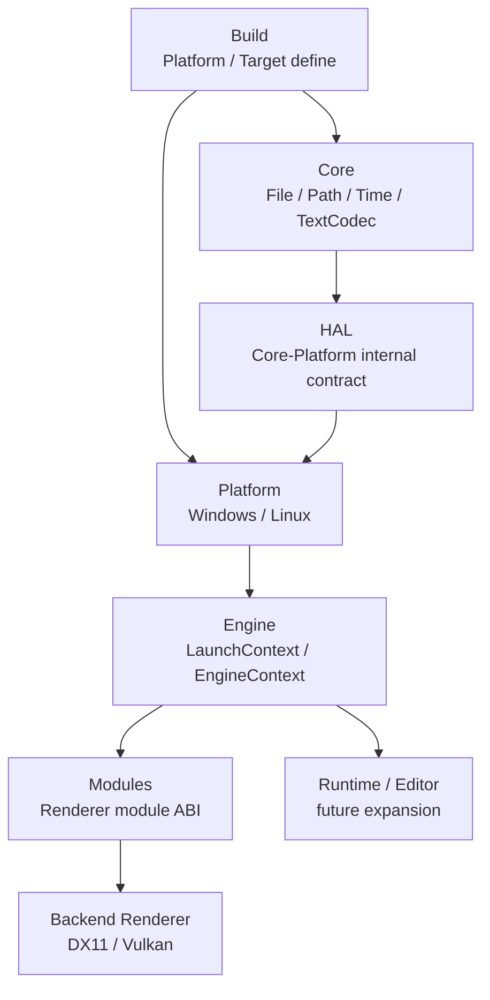
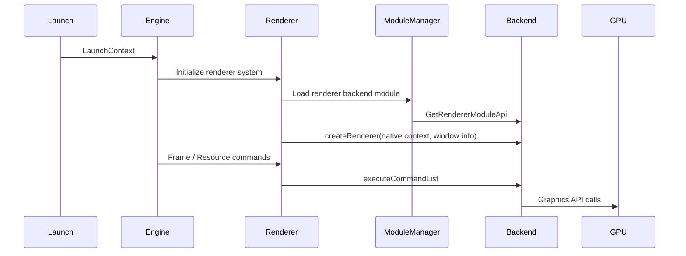
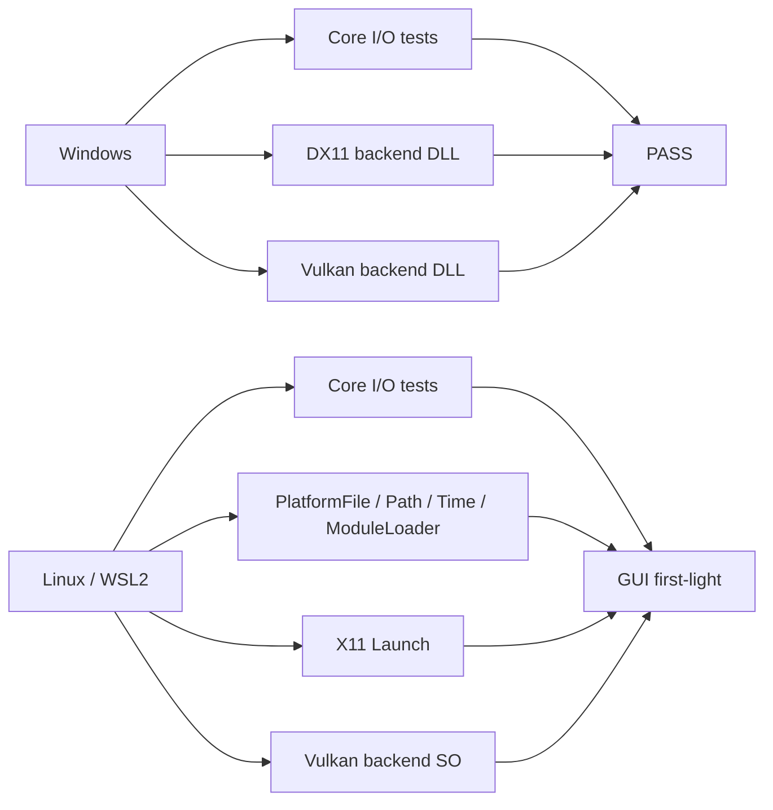

# CyphenEngine

CyphenEngine은 개인 엔진 개발 프로젝트입니다.

목표는 거대한 범용 엔진을 복제하는 것이 아니라, 엔진의 핵심 책임을 직접 설계하고 검증하면서 **DOD(Data-Oriented Design), 모듈식 구조, 빌드 타임 추상화**를 중심으로 한 실행 기반을 만드는 것입니다.

현재는 Core / Platform / Engine / Modules의 기본 경계를 세우고, Windows와 Linux 양쪽에서 Renderer backend module을 로드해 화면 출력까지 검증한 상태입니다.

## 현재 상태

2026년 7월 기준 CyphenEngine은 다음 지점까지 도달했습니다.

- Core I/O와 경로, 텍스트 인코딩, 시간 시스템의 기본 경계 정리
- Windows / Linux Platform 구현 기초 연결
- 동적 Renderer module ABI 구성
- DX11 backend DLL 로드와 텍스처 표시 검증
- Vulkan backend DLL / SO 로드와 텍스처 표시 검증
- WSL2 Linux GUI 환경에서 `CyphenRendererVulkan.so` 로드, Vulkan surface / swapchain / pipeline 초기화, 리소스 출력 확인

아직 완성된 게임 엔진은 아니며, 현재 단계는 **엔진 구조가 실제 실행 파일과 backend module 위에서 성립하는지 검증하는 first-light 단계**입니다.

## 설계 방향

### DOD 지향

데이터 배치, 실행 흐름, 비용 모델을 중요하게 봅니다.

객체 모델을 전면 부정하지는 않지만, 성능과 책임 경계를 흐리는 추상화는 피합니다.

### 모듈식 엔진

Renderer는 Engine에 고정된 구현이 아니라, Module ABI와 backend DLL / SO를 통해 연결됩니다.

Windows에서는 `CyphenRendererDx11.dll`과 `CyphenRendererVulkan.dll`, Linux에서는 `CyphenRendererVulkan.so`를 backend module로 다룹니다.

### 빌드 타임 추상화

플랫폼처럼 빌드 시점에 확정 가능한 차이는 빌드 시스템이 선택합니다.

런타임 인터페이스나 가상 디스패치를 기본값으로 두지 않고, 빌드가 이미 아는 정보는 빌드 타겟과 플랫폼 define으로 고정합니다.

## 구조 개요



## Renderer 실행 흐름



## 플랫폼 상태



## 주요 구현 범위

현재까지의 주요 기반은 다음과 같습니다.

- `Build`
	- 플랫폼 define과 build target define 주입
	- `Editor`, `Game`, `Server` build target 구분
	- Windows Visual Studio 빌드와 Linux CMake 빌드 병행

- `Core`
	- File / FileSystem / Path / Time / TextCodec 정리
	- OS API 직접 호출 금지
	- Debug 회귀 테스트 구성

- `Platform`
	- Windows Platform 구현
	- Linux Platform 구현
	- Linux `dlopen` 기반 ModuleLoader
	- Linux X11 Launch와 window 생성

- `Engine`
	- LaunchContext / EngineContext 기반 실행 정보 전달
	- Engine Thread와 Renderer 초기화 흐름 구성

- `Modules`
	- Renderer module ABI 구성
	- DX11 backend
	- Vulkan backend
	- RenderCommand / ResourceCommand 실행 경로

## 테스트 기준선

현재 확인된 기준선은 다음과 같습니다.

| 항목 | 상태 |
|---|---|
| CoreIoTests | `PASS=69 / FAIL=0` |
| ModuleTests | `PASS=34 / FAIL=0` |
| Windows DX11 backend | 빌드 및 텍스처 표시 확인 |
| Windows Vulkan backend | 빌드 및 텍스처 표시 확인 |
| Linux Vulkan backend | `CyphenRendererVulkan.so` 로드 및 GUI 출력 확인 |

테스트와 진단 출력은 Debug 기준으로 운용합니다.

## 빌드

### Windows

Windows 빌드는 Visual Studio `.sln` / `.vcxproj` 기반입니다.

주요 프로젝트는 다음과 같습니다.

- `CyphenEngine`
- `CyphenRendererDx11`
- `CyphenRendererVulkan`
- `CyphenRendererOpenGLES`

### Linux / WSL2

Linux 빌드는 CMake 기반입니다.

필요한 대표 패키지는 다음과 같습니다.

```bash
sudo apt update
sudo apt install cmake ninja-build build-essential libvulkan-dev glslang-tools libx11-dev libturbojpeg0-dev
```

Linux Debug Editor 빌드 예시는 다음과 같습니다.

```bash
cmake -S . -B BuildArtifacts/Intermediate/Linux/x64/Debug/Linux_Vulkan_Debug -G Ninja -DCMAKE_BUILD_TYPE=Debug -DCYPHEN_BUILD_TARGET=Editor
cmake --build BuildArtifacts/Intermediate/Linux/x64/Debug/Linux_Vulkan_Debug
```

실행 산출물은 다음 위치에 생성됩니다.

```text
BuildArtifacts/Binaries/Linux/x64/Debug/
```

대표 산출물은 다음과 같습니다.

```text
CyphenEngine
CyphenRendererVulkan.so
TexturedQuad.vert.spv
TexturedQuad.frag.spv
Resources/
```

실행 예시는 다음과 같습니다.

```bash
cd BuildArtifacts/Binaries/Linux/x64/Debug
./CyphenEngine
```

## 다음 단계

다음 단계에서는 Linux first-light 이후의 안정화와 Runtime / Editor 확장을 다룹니다.

- Linux renderer 안정화
	- GPU device 선택
	- validation layer 설정
	- swapchain resize 대응
	- frame pacing 정리

- Linux Server / headless 타겟 분리
	- X11 의존성 제거 시점 판단
	- Launch 소스 분리 검토
	- renderer module 제외 빌드 경로 정리

- Renderer 구조 확장
	- FrameQueue 정리
	- ResourceManager 정식화
	- Mesh / Material 확장
	- backend별 완성 범위 재정리

- Runtime / Editor 경계 확장
	- Game runtime 구성
	- Editor runtime 구성
	- UserPreference / Module descriptor resolver 정리

## 개발 방식

- 작은 단위로 설계하고 검증합니다.
- 구현보다 책임 경계를 먼저 봅니다.
- 트리거가 오기 전까지 계층을 만들지 않습니다.
- 자동화보다 실제 엔진 설계를 우선합니다.
- DevLog는 작업 흐름 단위로 핵심 결정만 압축해 남깁니다.
